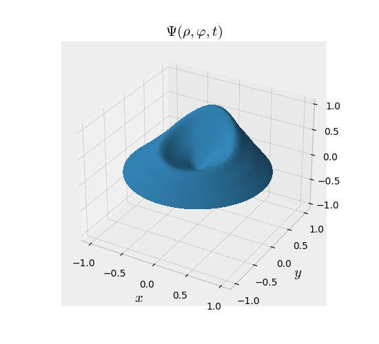
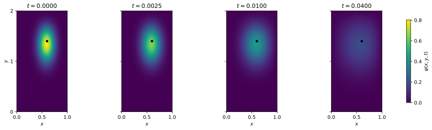

# Ayudantías

Repositorio personal para organizar el material que preparo para los cursos donde soy ayudante de pizarra.

Actualmente reúne material principalmente de dos cursos:

- **Campos y Ondas**
- **Física Matemática 2**
- **Electrodinámica I**

Cada carpeta contiene sus propios problemas, desarrollos, etc. En general, las carpetas pueden contener archivos `.tex`, PDF compilados, notebooks, scripts de visualización y figuras en formato `.svg`.

## Simulaciones y visualizaciones destacadas

**Evolución de la ecuación de Schrödinger en la esfera**  
Visualización de una solución dependiente del tiempo en geometría esférica ([código](fisica-matematica-2/schrodinger_esfera/schrodinger_esfera.ipynb)).

**Ondas 2D en disco**  
Evolución de una solución de la ecuación de ondas sobre un tambor circular mediante funciones de Bessel ([código](fisica-matematica-2/onda_2d_tambor_bessel/onda_disco_funcion_rara.ipynb)).

**Difusión del calor 2D en un rectángulo**  
Evolución temporal de una solución de la ecuación del calor en dos dimensiones ([código](fisica-matematica-2/calor_2d_rectangulo/calor_2d_rectangulo.py)).

## Agradecimientos

Agradezco a **Guillermo Rubilar** por facilitar desarrollos de algunos problemas y por compartir notebooks utilizados como apoyo visual en Física Matemática 2, en particular los asociados al tambor circular y a la difusión del calor 2D. Agradezco también a **Félix Borotto** por facilitar algunas soluciones que sirvieron como referencia para la elaboración del material de Campos y Ondas. Agradezco a **Pablo Solano** por facilitar los problemas resueltos para la elaboración del material de Electrodinámica I.

Reconozco el uso de **ChatGPT Plus** y **Claude Pro** como herramientas de apoyo para la asistencia en LaTeX, la generación y edición de figuras en TikZ y Python, y la organización del material. El contenido final fue revisado y editado antes de ser incorporado al repositorio.
